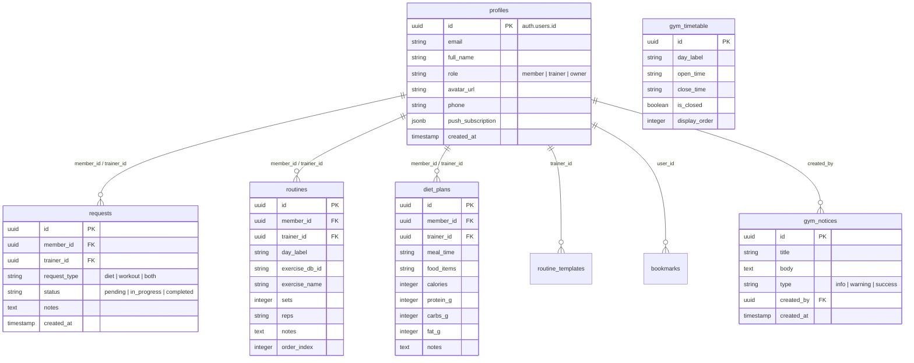

# Fitconnect — Gym Trainer & Member Hub

[](https://nextjs.org/)
[](https://react.dev/)
[](https://supabase.com/)
[](https://tailwindcss.com/)

**Fitconnect** (powered by the **Vortex Fitness Club** engine) is a premium, full-stack gym management web application designed to bridge the gap between gym owners, fitness trainers, and club members. It provides a seamless, interactive portal for building workouts, generating nutrition plans, tracking progress, and broadcasting announcements.

---

## 🚀 Key Features by User Role

Fitconnect implements a strict, role-based access control system split into three specialized portals:

### 👑 1. Gym Owner Portal
Designed to oversee gym administration, staff coordination, and club updates.
* **Trainer Provisioning**: Register and create new trainer accounts, adding them directly to the database.
* **Announcements Board**: Publish global gym notices (notifying trainers and members of schedule changes, events, or maintenance).
* **Timetable Editor**: Modify gym opening and closing hours dynamically, instantly updating the public landing page.
* **Analytics Dashboard**: Monitor overall gym activity, requests volume, and member/trainer ratios.

### 🏋️ 2. Personal Trainer Portal
Empowers fitness coaches to manage their roster and deliver tailored workout & nutrition guidance.
* **Roster Management**: Track assigned members and view their physical parameters and goals.
* **Workout Routine Builder**: Construct highly granular daily workouts using the global exercise catalog.
* **Diet Planner**: Generate custom meal charts specifying meals, macronutrients (Protein, Carbs, Fats), and timing.
* **Routine Templates**: Save favorite routines as templates to quickly reuse and assign them to multiple members.
* **Request Pipeline**: Review, progress, and complete workout/diet plan requests submitted by members.

### 🤸 3. Member Portal
An interactive portal for fitness enthusiasts to follow routines, explore exercises, and communicate with coaches.
* **Interactive Dashboard**: View assigned daily routines, workout instructions, and trainer notes.
* **Personalized Nutrition**: Access detailed meal schedules and macronutrient goals set by trainers.
* **Request System**: Submit direct requests to trainers for diet plans, workout plans, or both.
* **Exercise Explorer**: Search and filter a catalog of over 800+ exercises by target muscle, body part, or equipment. Includes detailed animated demonstration links.
* **Bookmarking**: Save target exercises to a personal bookmark list for quick access during workouts.

---

## 🛠️ Technology Stack

Fitconnect is built using modern, production-grade tools:

| Component | Technology | Description |
| :--- | :--- | :--- |
| **Framework** | **Next.js 16 (App Router)** | Leverages React Server Components, Server Actions, and API Route Handlers. |
| **UI Library** | **React 19** | Implements React's latest hooks and concurrent features. |
| **Database & Auth** | **Supabase** | PostgreSQL database with strict Row Level Security (RLS) policies and auth triggers. |
| **State Management** | **TanStack React Query v5** | Performs efficient, cacheable client-side data fetching and synchronization. |
| **Styling** | **Tailwind CSS v4** | Utilizes CSS variables and utility classes for a dark-themed aesthetic. |
| **Animations** | **Framer Motion** | Provides smooth page transitions and interactive micro-animations. |
| **Mail Transport** | **Nodemailer (SMTP)** | Delivers high-quality HTML email alerts when plans are updated. |
| **Push Alerts** | **Web-Push** | Promotes offline updates and browser push notifications. |

---

## 📊 Database Schema (PostgreSQL)

The system utilizes a structured relational schema in Supabase. Below is a summary of the core database tables:



---

## ⚙️ Setup & Installation

### 1. Clone the Repository & Install Dependencies
```bash
git clone https://github.com/rubayet36/Fitconnect.git
cd Fitconnect
npm install
```

### 2. Configure Environment Variables
Create a `.env.local` file in the root directory:
```env
# Supabase Configuration
NEXT_PUBLIC_SUPABASE_URL=https://your-supabase-project.supabase.co
NEXT_PUBLIC_SUPABASE_ANON_KEY=your-supabase-anon-key
SUPABASE_SERVICE_ROLE_KEY=your-supabase-service-role-key

# Nodemailer / Gmail SMTP Configuration (For Email Notifications)
GMAIL_EMAIL=your-configured-sender@gmail.com
GMAIL_APP_PASSWORD=your-google-app-password

# Web Push Notification VAPID Keys
NEXT_PUBLIC_VAPID_PUBLIC_KEY=your-vapid-public-key
VAPID_PRIVATE_KEY=your-vapid-private-key
```

### 3. Initialize the Supabase Database
1. Go to your **Supabase Dashboard** ➔ **SQL Editor**.
2. Create a new query and paste the complete database structure from [full-schema.sql](file:///f:/Vortex%20Traieer%20and%20Member%20app/full-schema.sql).
3. Click **Run** to execute. This will set up tables, seed the timetable, configure custom user triggers, and apply Row-Level Security (RLS) policies.

### 4. Create and Seed the Owner Account
Since the Owner is a unique administrative account, you must seed it explicitly:
1. Go to your **Supabase Dashboard** ➔ **Authentication** ➔ **Users**.
2. Click **Add User** ➔ **Create User**.
3. Use the following credentials:
   * **Email**: `vortexfitnessclub001@gmail.com`
   * **Password**: *[Set a secure password]*
   * Toggle **Auto Confirm User** to `ON`, then save.
4. Start your development server:
   ```bash
   npm run dev
   ```
5. In your web browser, open the developer console (F12) and run the following fetch request to upgrade the profile role to `owner`:
   ```javascript
   fetch('/api/seed-owner', { method: 'POST' })
   ```

### 5. Running Locally
Start the development server:
```bash
npm run dev
```
Open [http://localhost:3000](http://localhost:3000) to access the landing page.

---

## 📧 Email Alerts Setup (SMTP)

The app automatically sends rich HTML emails to members when a trainer finishes compiling their diet charts or workout schedules.

To enable this:
1. Log into your Gmail account and head to **Google Account Settings** ➔ **Security**.
2. Turn on **2-Step Verification**.
3. Under **App Passwords**, generate a password for your web app.
4. Copy the generated 16-character code and paste it into `.env.local` as `GMAIL_APP_PASSWORD`.
5. Enter your email address as `GMAIL_EMAIL`.

---

## 📄 License

This project is licensed under the MIT License.
